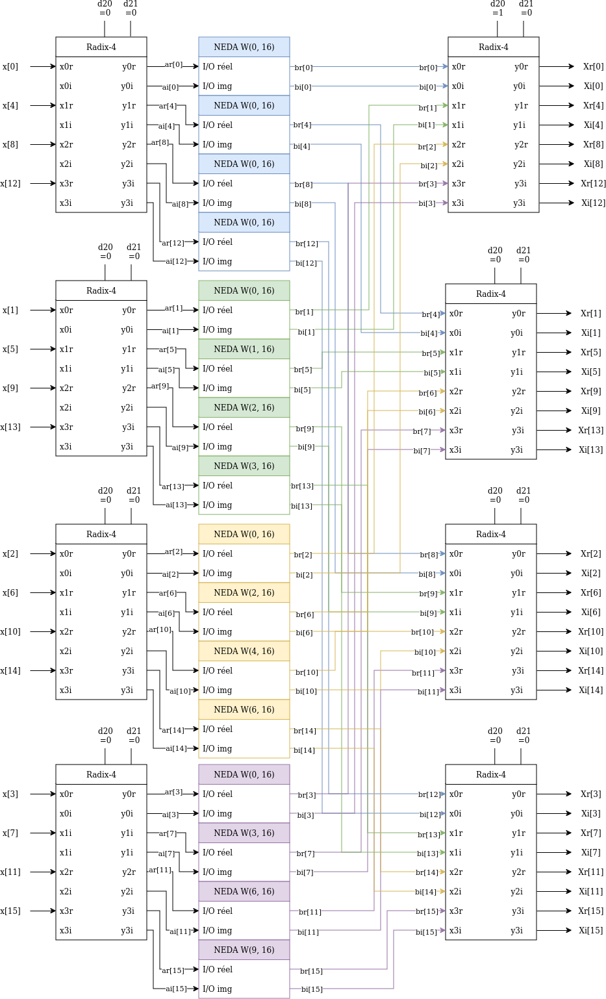

# FFT-16 on FPGA

The goal of this project is to implement a 16 points FFT on FPGA.

# Matlab model

First, the computing model was implemented on MATLAB script to try computing logic. The fft-16 is composed of Radix-4 blocs as follows:

This is the output on a 5Hz cosinus sample at $f_e=20Hz$:

<u>Input signal (temporal):</u>

<u>FFT-16 result (frequency domain):</u>

# Quartus Synth

After implementing a first combinatorial implementation we have 2444 logic elements () for a maximum frequency of 51.33MHz. Let's not forget that the ADC module has a sample frequency of 1MHz at its maximum.

To improve this, we can add a D-latch state to cut down the critical path by half.

This gives us a max logic elements of 2455 for a frequency of 88.79MHz. If we look closer, only the number of register increased because of the latch logic from ... to 515.

We could still cut the critical path between the latch stage and the output of the FFT. 2385 combinational resources for 704 registers and a max frequency of 120.88MHz.

Now, the critical path is between the input and the first latch stage. By splitting it by two we have: 2385 combinational resources for 908 registers and fmax of 152.16MHz.

At this time, the new critical path is between the end of the last Radix-4 and the output of the FFT, during the absolute computation. If we try to optimize this path we could try to gain a few MHz. 

This time we have 1124 registers with 2398 LUT and 162.68MHz.

Now, the critical path is inside the NEDA block, to optimize that we can split the computation by half as done with the abs function. With this optimisation we have a maximum frequency of 185.7MHz for 1394 registers and 2253 LUT. With that, the critical path is inside the Radix-4 block.

After adding D-latch stage inside the Radix-4 component, the max frequency is 226.19MHz for 1890 registers and 2247 LUT. This seems to be the maximum frequency because now, the critical path is a primitive multiplication between the output of the first Radix-4 stage and the fixed NEDA weight. This is a series of LUT and cannot be subdivide into smaller steps.

But with this pipelined design it is import to check that all stage of the architecture go through the same latch wall. Unfortunatly, inside the NEDA block to ensure that this condition is right we need to add a latch even for the optimized coefficient that are equal to one. Otherwise, some path would skip some latch step and be out-of-sync from the other values. This gives us 1887 registers for 2254 LUT and a max frequency of 223.41MHz. This difference can be explained by difference in optimization applied by Quartus.
